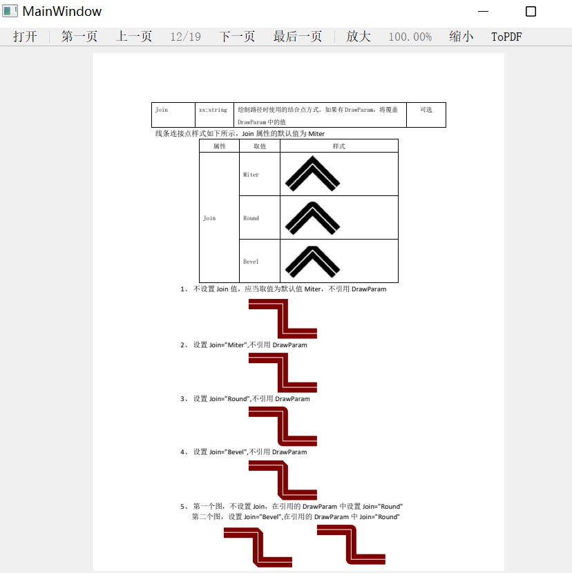
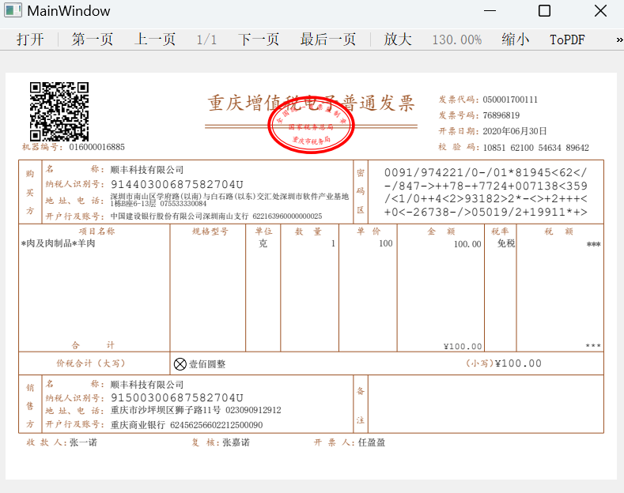
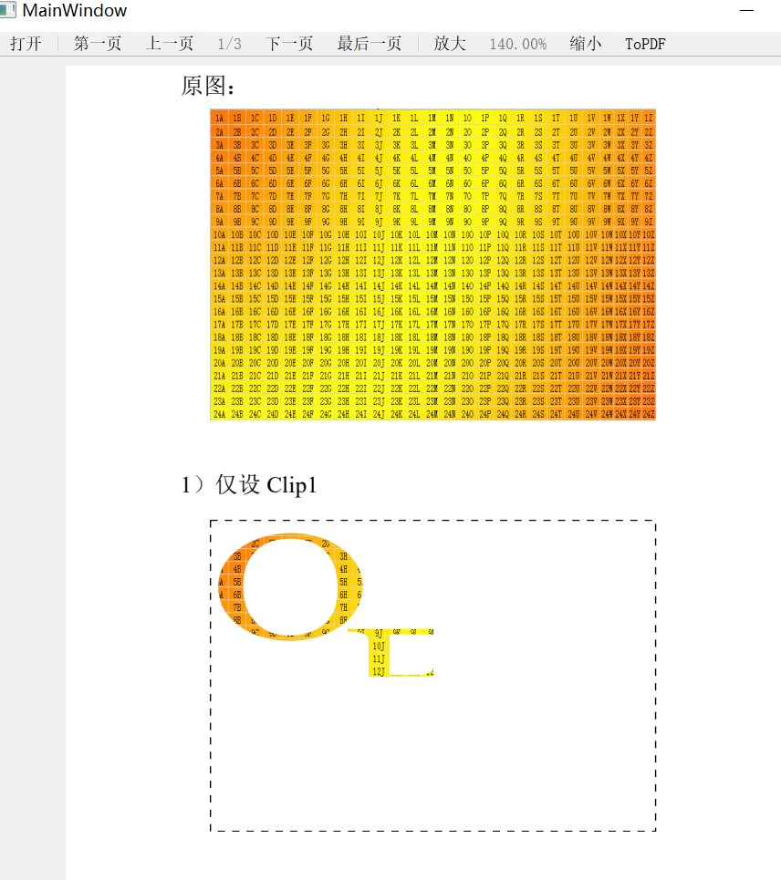
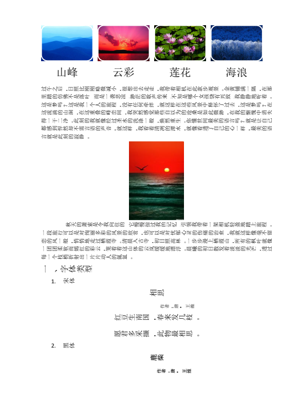
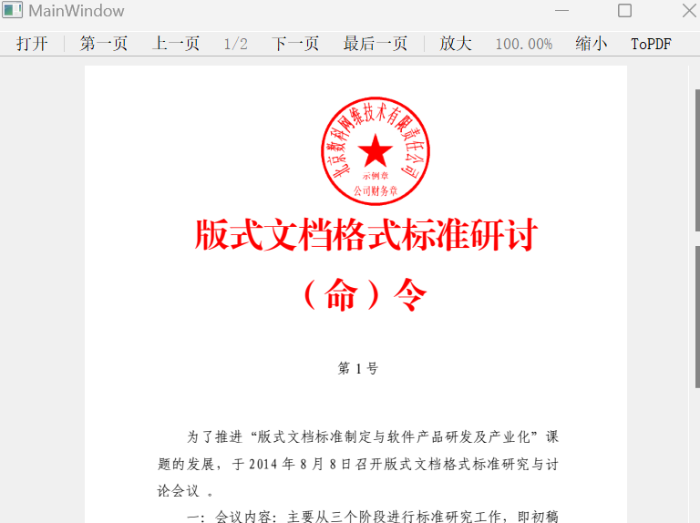
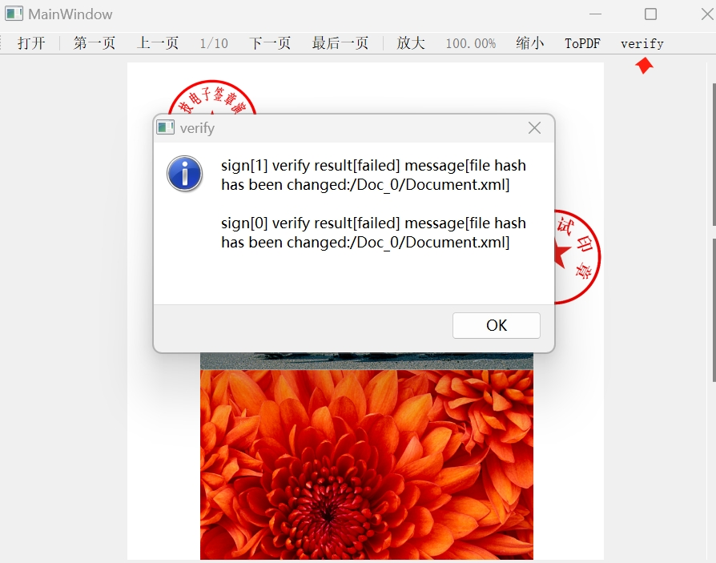
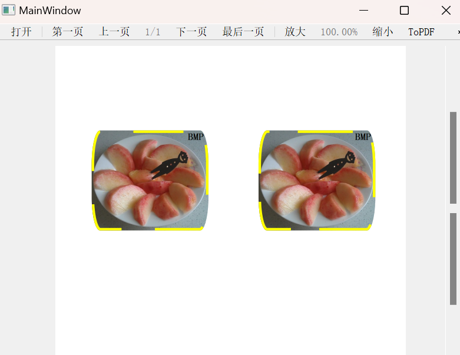
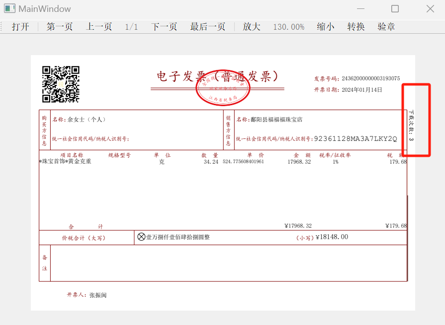
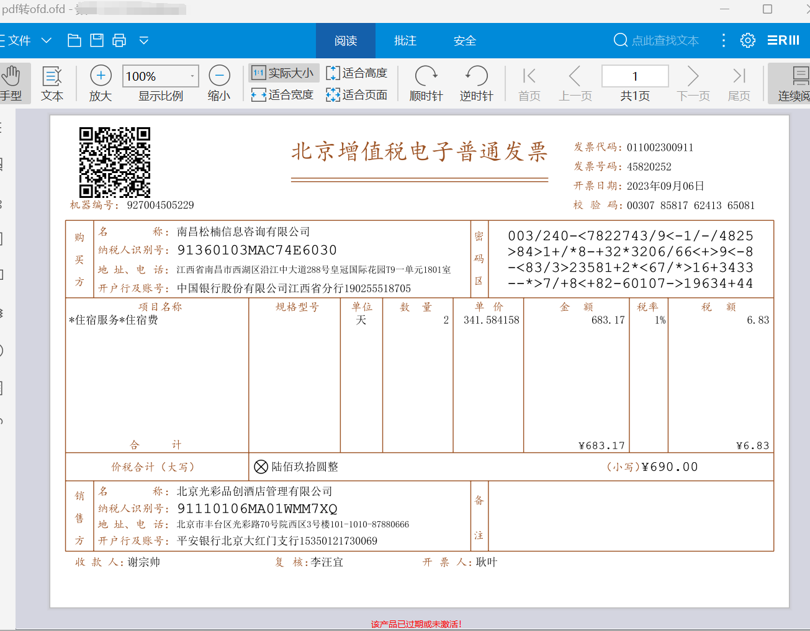

# XilouReader  
专注pdf阅读，pdf处理，ofd阅读，ofd处理,pdf转ofd以及ofd转pdf引擎功能开发。基于pdfium的ofd/pdf双引擎版式阅读器。  

现状  
1。PDF阅读  
2。OFD常规文档，发票，公文的阅读及签章验证通常不会有问题，有问题请报issue附上文档  

history:  
2024-06-13：实现ofd文档合并  
2024-06-10：实现了图像转pdf/ofd, 双层pdf/ofd，见convertcases下的test.png/test.png.json/img2ofd.ofd/img2pdf.pdf  
2024-02-03：简单pdf转ofd  
2023-12-25:实现PDF转.txt文件功能  

目录说明：  
out/release目录下是windows下的预编译版本，只测试了windows11(windows10应该也可以)  
ofdcases目录用于上传ofd用例文档， 有任何渲染有问题的文档，欢迎 pull request  
convertcases目录用于上传pfd转ofd, ofd转pdf用例文档， 有任何有问题文档，欢迎 pull request   
OfficeMaster_document_convert_system 目录放置的是OfficeMaster多格式文档转换系统的授权文件  
详见https://github.com/Chingliu/OfficeMaster_document_convert_system 或  
https://gitee.com/chingliu/OfficeMaster_document_convert_system  

TODO  
1. 签章解析（ofd已支持签章解析及验章）  
2. 字体裁剪  
3. pdf转ofd  

preview:

convert:

